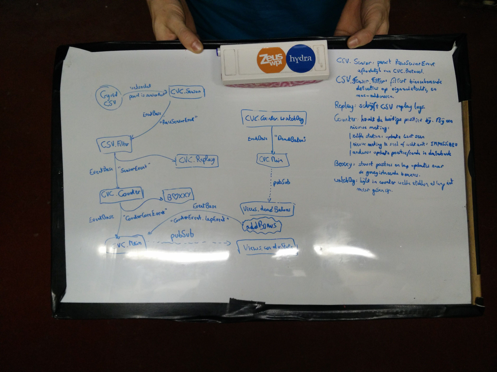

# count-von-count

## Fix your Haskell

First of all, fix your Haskell by installing [Stack](https://docs.haskellstack.org/en/stable/README/). (You can use your own package manager, ex. `sudo xbps-install stack`)

Next, install cabal-install with `stack install cabal-install`.

**When you are running or installing `cabal` or `ghci` manually (without stack), you're doing it wrong.**

## Dependencies

Stack will fix this for you.

## Usage

To build the application run `stack build`. The executable is now available somewhere in the depths of `.stack-work/...`. You can install the cvc executable locally with `stack install`.

### Developing the application:

1. Run `stack ghci` from the project folder
2. Select the main package (option 1: `src/CountVonCount.hs`)
3. Enter `main` to start the program, `^C` to interrupt
4. Enter `:r` to reload all changed modules

For the Replayer (`src/Replayer.hs`) you can set the location of the replay
file with `:set args ../location/to/replay.log`.

### Testing the application:

Simple unit tests can be run with:

```
stack test
```

It is recommended to do a simulation (using `count-von-count-simulation`) or
a real life run to test every aspect of cvc.

### Database population

You can create/reset the count-von-count database (containing team names,
station names, station distances (!), ... ) using the files in `scripts/`.

Run them using `stack runghc scripts/teams2017.hs` (this will wipe the current 
database).

OR

1. Run `stack ghci` from the project folder
2. Load the scripts (for instance `scripts/teams2019`) with `:l
   scripts/teams2019.hs`
3. Run the script with `main`

## Other tools

### count-von-count-simulation

Simulates running teams and sends detections to count-von-count. Useful to test
networking, station misses, interaction with Boxxy, ...

The simulator:
- Has a simple ASCII visualization
- Keeps track of the round numbers (of the current simulation)
- Tries to simulate noisy detections by using a detection chance
- Can handle the absence of or restarts of count-von-count

```
                      S  S   S    S  S   S
HILOK                |   ?      X         | 3
VTK                  |       ?X           | 3
VEK                  |   ? X              | 3
VGK                  |               X    | 4
Hermes, Veto & Lila  |       ?  X         | 3
SK                   |       ?          X | 3
WVK                  |                   X| 3
HK                   |   X                | 3
Politeia              |            ? X     | 3
VPPK & Moeder Lies   |?X                  | 4
Wetenschappen & VLAK |   ?     X          | 3
VRG                  |   ? X              | 4
CHARPA               |   ?X               | 4
VLK                  |   X                | 4
VDK & Pharma         |   X                | 4
VBK                  |   X                | 3
Blandinia            |?    X              | 3
                      X = current position
                      ? = last detected
                      Detection chance: 10.0%
```


### count-von-count-replayer

This replays a game by sending the same detection events (in 'real-time')
to count-von-count.

Usage:
```
count-von-count-replayer ../path/to/replay.log
```

## Overview

